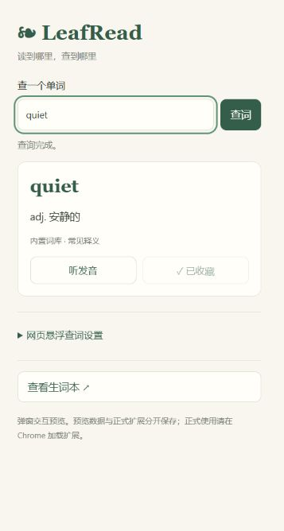
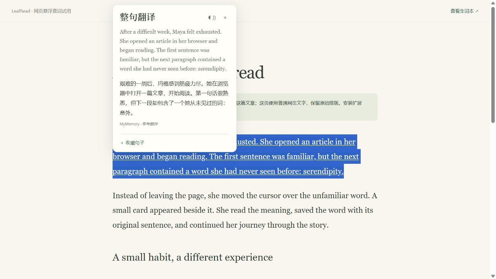

# LeafRead · 读英文，停一下就懂

一个轻量的 Chrome 网页查词扩展。鼠标停在英文单词上约 1 秒，就能看到中文释义；也可以点击扩展图标输入单词查询，把想记住的词留下来。

这是 **0.6.0 开源试用版**，尚未上架 Chrome Web Store。GitHub 与未来商店版本采用同一套功能：悬浮查词、整句参考翻译、输入查询、简单生词本。



## 使用

1. 下载 [v0.6.0 安装包](https://github.com/BB-TE/LeafRead/releases/download/v0.6.0/LeafRead-v0.6.0.zip) 并解压，也可以下载本仓库源码。
2. 在 Chrome 地址栏打开 `chrome://extensions`，开启「开发者模式」。
3. 点击「加载已解压的扩展程序」，选择其中的 **extension 文件夹**。无需安装 Node.js 或启动服务器。
4. 刷新已打开的英文文章，鼠标停在单词上约 1 秒即可查词。
5. 点击扩展图标可输入查询，卡片里的「收藏单词」会保存到「查看生词本」。

设置支持全局开关、当前网站开关、0.4～3 秒悬浮等待、按住 Alt 查询、关闭在线查询。

**整句翻译**：在网页选中英文句子或一小段文字，松开鼠标后显示译文；键盘选中文字也支持。也可以悬浮查词后，点击卡片里的「翻译整句」，查询该单词所在句子。支持最多 1500 个字符，较长文字按服务的单次长度限制分段查询并合并译文；超出范围会显示提示。分段译文仅供参考，可能缺少跨段语境。



生词本可以查找、听发音、移除和导出 CSV。网页收藏附带原句及原文链接，手动查询收藏只记录单词和释义。数据保存在当前浏览器，不需要账号。


## 更新

将新版文件覆盖到原扩展目录，在扩展管理页点击 LeafRead 的重新加载按钮，再刷新文章页。不要先移除扩展，以免清除原有收藏。出现「扩展已更新」提示时刷新文章；如果发生在面板中，关闭后重新打开面板即可。

第一版发行包不包含本地书籍阅读器，不需要上传书籍。旧版本已经保存的收藏继续兼容；本地开发保留的阅读器实验文件不属于此发行版。

## 支持范围

使用浏览器的文本定位接口直接识别鼠标下的单词，不截图、不做 OCR，也不批量改写网页正文。普通文章、博客和使用真实文字的在线书籍可以使用，包括允许注入脚本的 iframe。

图片、扫描书、纯 canvas 绘制的文字、Chrome 内置 PDF 阅读器、`chrome://` 页面和浏览器禁止注入的页面暂不支持。某些封闭的在线书城也无法取词。释义是词典查询结果，此版没有 AI 上下文消歧。

## 词典与隐私

优先使用内置小词库和既有查询缓存；未收录的单词通过有道网页公开查询端点获取，短语和句子通过 MyMemory 查询。主词典失败时自动尝试 MyMemory 的单词参考翻译，备用结果不提供词典级音标和多义释义。卡片提供重试，并区分网络连接、限流或免费额度、服务返回数据异常；失败或部分完成的译文不写入缓存。公共代理可能共享服务额度。

接口仍可能变更、限流或不可用。**当前是原型接入，尚未取得商业数据服务保障；正式推广前需要确认数据许可与稳定的服务方案。** 本项目的 MIT 许可仅覆盖项目代码，不代表第三方词典数据的授权。

悬浮单词时只发送该单词；选择句子或点击「翻译整句」时，会发送所选文字或该单词所在的句子，不自动上传整篇正文、收藏或阅读历史。关闭在线查询后仅使用内置词库和缓存。听发音使用浏览器语音能力，音标在词典提供时显示。详情见 [隐私说明](PRIVACY.md)。

## 开发

运行测试、构建和本地界面预览需要 Node.js 20 或更新版本：

```sh
npm ci
npm test
npm run build
npm run preview
```

预览地址为 `http://127.0.0.1:4318/popup-demo.html`，它用于检查页面交互。网页悬浮、扩展权限与后台生命周期仍需加载真实扩展验证；预览收藏与扩展收藏相互独立。

构建生成 `dist/LeafRead-v0.6.0.zip`（安装包）与 `dist/LeafRead-v0.6.0-source.zip`（源码包）。发行脚本按文件清单打包，不包含实验阅读器、书籍、个人收藏、node_modules 或本机路径。

## 贡献与许可

欢迎反馈不能取词的页面、释义异常、查词打断阅读的情况，或提交修复。反馈时可以提供复现步骤及网页类型，避免附带私人内容。

项目代码使用 [MIT License](LICENSE)。第三方服务和 npm 依赖遵守各自许可与使用条款。
